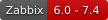
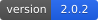
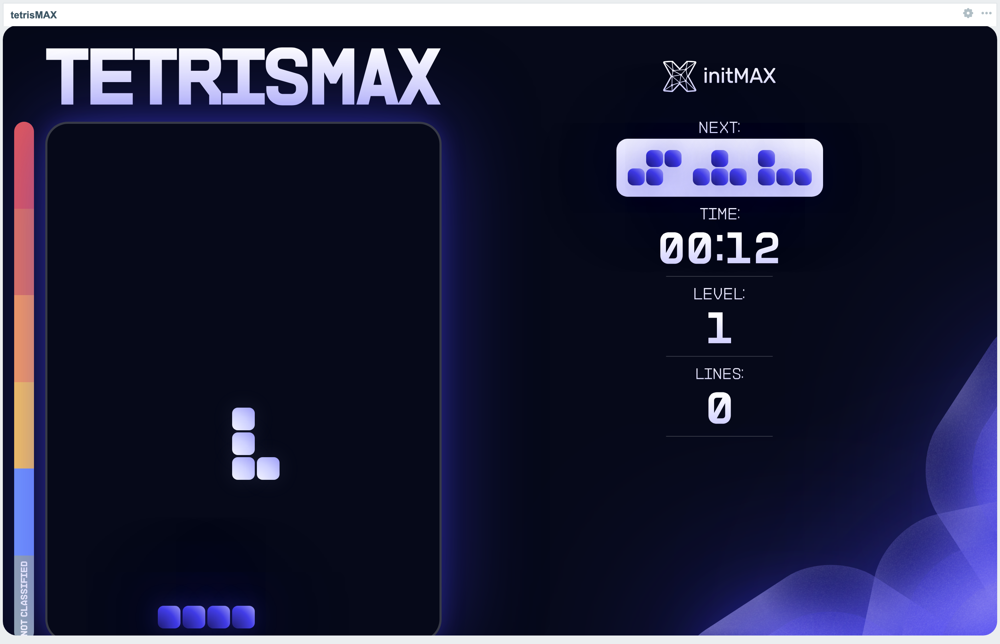
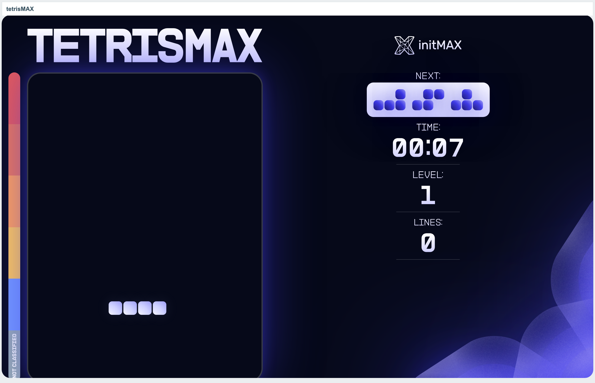

<h1>tetrisMAX</h1>

developed and maintained by

and community

<strong>Tetris on a Zabbix dashboard.</strong> 
The game everyone knows, as a widget: add it to a page, press an arrow key, and play. It runs entirely in your browser - the widget asks Zabbix for a board and never speaks to it again.

<a href="#what-it-is"><strong>Features</strong></a> &nbsp;·&nbsp;
<a href="#how-to-play"><strong>How to play</strong></a> &nbsp;·&nbsp;
<a href="#install"><strong>Install</strong></a> &nbsp;·&nbsp;
<a href="#what-it-does"><strong>What it does</strong></a> &nbsp;·&nbsp;
<a href="https://portal.initmax.com"><strong>Portal</strong></a> &nbsp;·&nbsp;
<a href="https://www.initmax.com/wiki/tetrismax/"><strong>Docs</strong></a>

---

## Why tetrisMAX

Because a monitoring dashboard is where people wait. tetrisMAX is initMAX's gift to the Zabbix community - a genuinely complete game, given away, on the tool you already run. It is also the least demanding widget we ship: it reads no item, writes nothing, and makes exactly one request in its life.

## What it is

<table>
<tr>
<td width="50%" valign="top">

**The whole game**
Seven pieces, four rotations each, a next-piece queue, line clears, rising levels and a running clock.

</td>
<td width="50%" valign="top">

**Nothing leaves the browser**
No Zabbix API call, no item, no stored score, no profile row. The tile is drawn once and the game runs client-side.

</td>
</tr>
<tr>
<td width="50%" valign="top">

**Three speeds**
Slow, Normal or Fast to open with. The game speeds up on its own with every level.

</td>
<td width="50%" valign="top">

**A severity bar you will recognise**
The stack height is drawn against Zabbix's own severity colours, from Not classified up to Disaster.

</td>
</tr>
<tr>
<td width="50%" valign="top">

**Every supported Zabbix**
One package covers 6.0 through 7.4 - the same board, the same form, the same look.

</td>
<td width="50%" valign="top">

**In your language**
The configuration form follows each user's own Zabbix display language.

</td>
</tr>
</table>

## How to play

Add the widget to a dashboard and the game starts by itself. The dashboard page has to have focus - click it once - and then:

| Key | Does |
| --- | --- |
| **←** / **→** | move the piece sideways |
| **↑** | rotate |
| **↓** | drop one row |
| **Space** | hard drop |

Every minute the level goes up and the pieces fall faster. When the stack reaches the top the game shows your score and a **Play again** button. The score is shown and then forgotten - there is no board to post it to.

## Configuration

One field: **Speed** - the pace the game opens at. Everything else about a game of Tetris is decided by playing it.

## Install

tetrisMAX ships as a **GPG-signed `deb` / `rpm` package** from the initMAX repository, so `apt` / `dnf` installs it and keeps it updated.

### Easiest way - the guided installer on the Portal

Open the product page, pick your **OS**, and copy the ready-made command. tetrisMAX is fully public, so there is nothing to sign in to.

<a href="https://portal.initmax.com/catalog/zabbix-tetrismax#how-to-install"><strong>→ Open the installer on the Portal</strong></a>

Prefer a plain archive? Every release also ships as a **ZIP**, [straight from the repo](https://repo.initmax.com/zabbix/free/zip/tetrismax/) - handy for offline or manual installs.

Then enable it in **Administration → General → Modules**. Done.

## What it does

tetrisMAX is a gift, so there is no paid edition of it - and with the score board gone there is nothing left that a paid edition could contain. Everything below is in the one package.

| Feature                                                          |        |
| ---------------------------------------------------------------- | :----: |
| The full game - board, pieces, levels and on-screen score        |   Yes  |
| Runs entirely in the browser - no Zabbix API call, nothing stored |   Yes  |
| Choice of falling speed                                          |   Yes  |
| One package for Zabbix 6.0 - 7.4                                 |   Yes  |
| Localised into all 25 Zabbix display languages                   |   Yes  |
| High availability ready                                          |   Yes  |

Earlier releases carried a PRO "score board" that asked players for a name and an e-mail and posted every finished game to the Zabbix API so a leaderboard could be built from items and problems. It was removed in 2.1.0: a game on a monitoring dashboard should not collect personal data or hold an API token. If you were running it, see the note under [Upgrading](#upgrading).

## Requirements

|              |                                                              |
| ------------ | ------------------------------------------------------------ |
| **Zabbix**   | 6.0 · 6.2 · 6.4 · 7.0 · 7.2 · 7.4 - one package covers all   |
| **PHP**      | 7.4 or newer                                                 |
| **OS**       | Debian/Ubuntu · RHEL/Rocky/Alma/Oracle/Amazon · SUSE         |
| **Editions** | FREE only - there is no paid edition                         |
| **Languages** | All 25 Zabbix display languages - the widget follows each user's own language setting |
| **Permissions** | None beyond seeing the dashboard. The widget reads no item, so it needs no host or item permission |
| **High availability** | Ready. No server-side component and no stored state of any kind; install it on every frontend node of an HA cluster and any node can serve it |

Everything above works on every supported version, including 6.0 and 6.2, whose module API predates the one the widget is written against - the package carries a second module tree for those two lines and the installer picks the right one. The board, the score panel, the severity bar and the configuration form are identical on all six versions; a game configured on any of them keeps its setting when Zabbix is upgraded, in either direction.

There is **no capability tetrisMAX offers on a newer Zabbix and not on an older one.** The game is drawn in the browser, so the frontend's age has nothing to bring to it.

## Upgrading

**From 2.0.x, if you used the score board:** it is gone, and so is the endpoint it posted to. Nothing needs uninstalling - the widget simply stops sending. The Zabbix items you pointed it at are untouched and keep whatever they already recorded; delete them yourself if you no longer want them. Any API token you created for it is no longer used by anything and should be revoked. Dashboards keep working: the widget ignores the settings it no longer has.

## Support &amp; links

- 📚 **[Documentation / Wiki](https://www.initmax.com/wiki/tetrismax/)**
- 🛒 **[Product page](https://www.initmax.com/product/tetrismax/)**
- 🎫 **[Portal](https://portal.initmax.com)** - downloads, support tickets
- 💾 **Source code** (AGPLv3) - included in every package and published as a [source archive](https://repo.initmax.com/zabbix/free/zip/tetrismax/) on repo.initmax.com
- ✉️ **[support@initmax.com](mailto:support@initmax.com)**

---

<a href="https://www.gnu.org/licenses/agpl-3.0.html">AGPLv3</a> &nbsp;·&nbsp; © 2021-2026 initMAX s.r.o.

